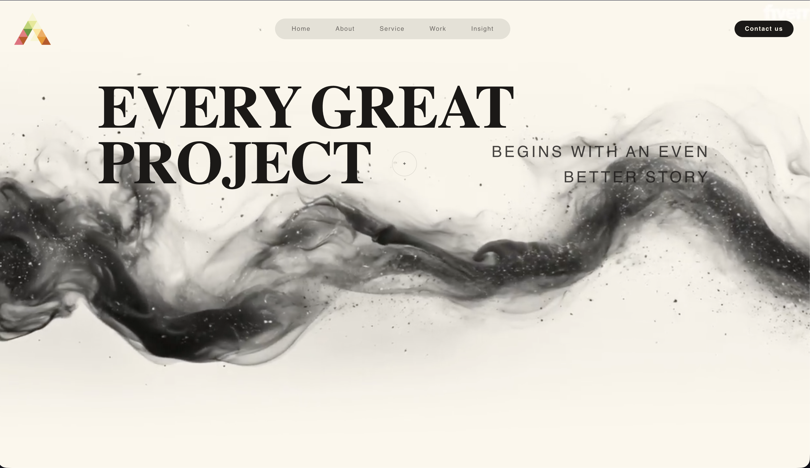

# Full Hero Section with Video Background

A clean and responsive Hero section built with Vue 3. It features an optimized video background and focuses on fast loading times and code stability.

## Live Link

You can see it in action here: [Live Preview](https://landingpagewtihtheparticlesystem.netlify.app/)

## Preview

<!-- You can replace this placeholder with your actual screenshot later -->



## Main Features

- Responsive layout that adapts well to any screen size.
- Smooth video background implementation.
- Lightweight codebase without unnecessary heavy dependencies.

## Tech Stack

- Vue 3 / Vite
- Tailwind CSS

## How to Run Locally

1. Clone the repository and navigate to the folder:
   ```bash
   git clone [https://github.com/Godsdar/Full-Hero-for-Alegra-Labs.git](https://github.com/Godsdar/Full-Hero-for-Alegra-Labs.git)
   cd Full-Hero-for-Alegra-Labs
   ```
